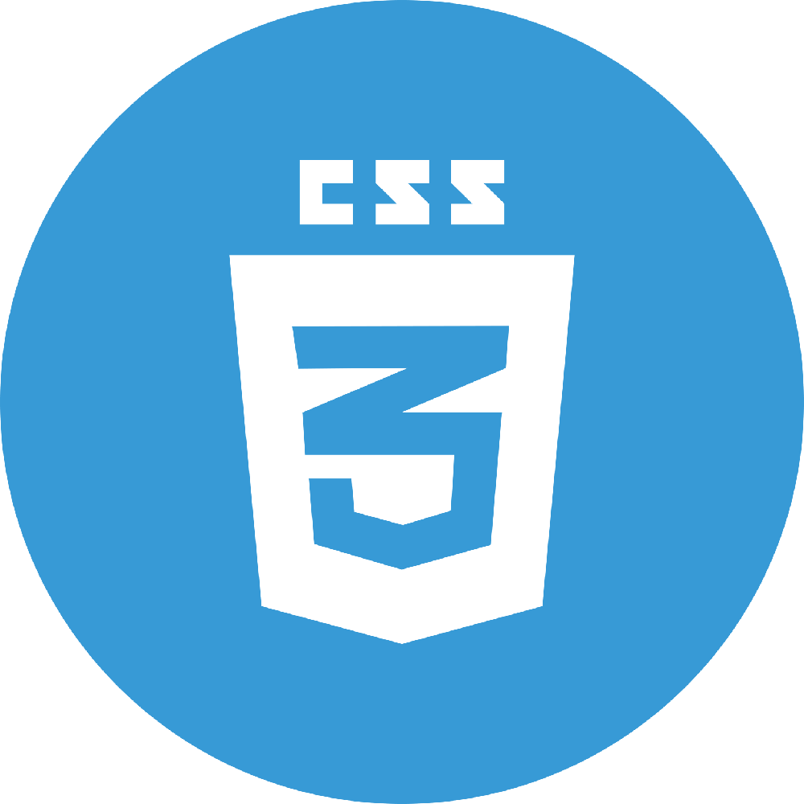
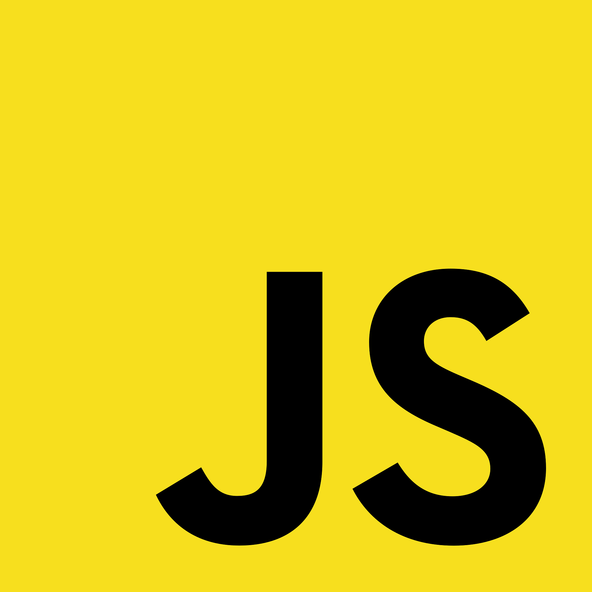
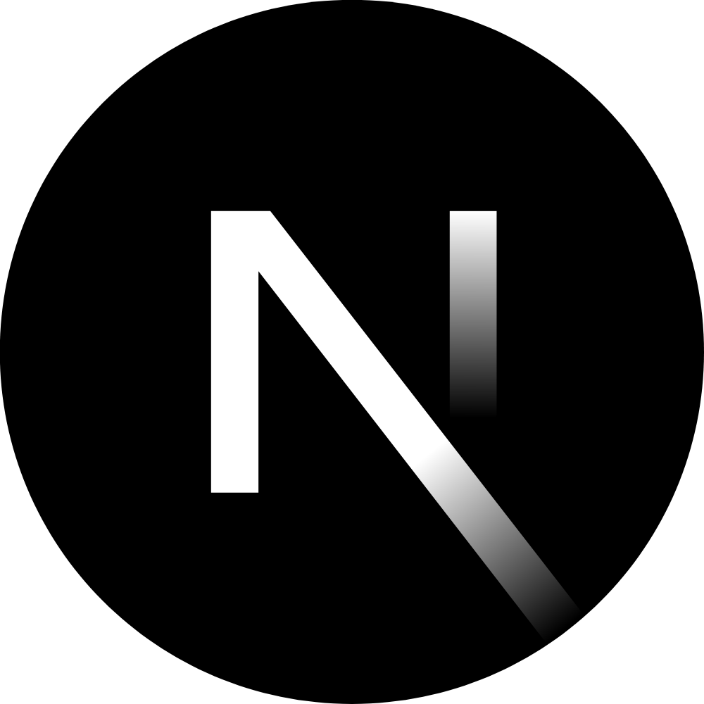
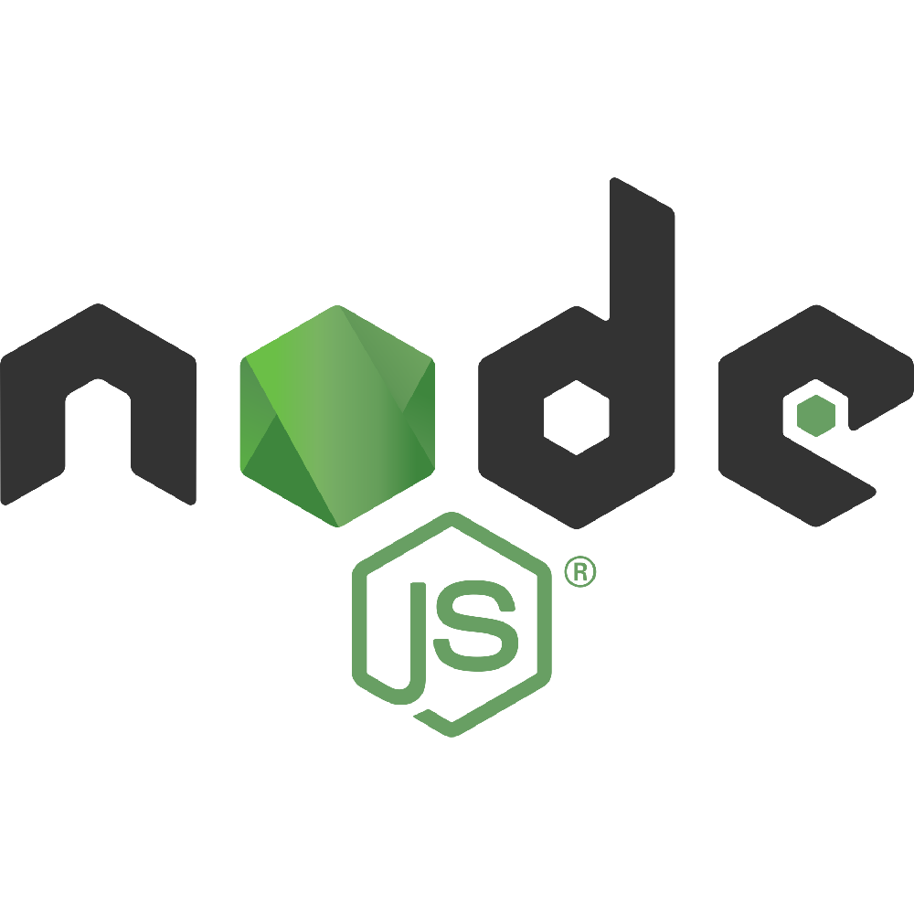

# Hi, I'm Mohamed Ibrahim 👋

## 💻 My Technical Skills (MERN Stack Developer)

I'm a MERN Stack-focused Web Developer passionate about building modern, responsive, and user-friendly web applications.

I use Linux 🐧 as my main development environment, and I enjoy turning ideas into real web experiences through clean code and practical projects.

I'm continuously improving my skills, writing better code, and learning modern web development practices.

I'm also a JavaScript enthusiast who enjoys understanding how things work under the hood.

  
  
  
  
  
  
  
  
  
  
  
  
  
  
  
  
  

## 📫 Connect with Me

  
    

  

